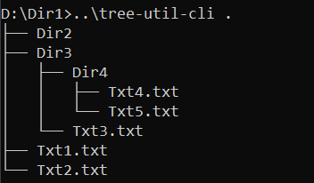

# tree-util-cli
Command line utility to print directory contents as tree.
## Usage
Print current dir as tree:
```cmd
tree-util-cli .
```
Print dir in absolute path as tree:
```cmd
tree-util-cli <absolute-path>
```


